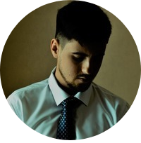

# CV
---

## Denis Utkov


## Contact details:


Phone          | Email               | Discord
:-------------:|:-------------------:|:-----------:
8-900-076-98-07|denis221195@gmail.com|StarLord#9769


---

_My goal is to become a frontend developer. I want to get all the necessary knowledge and experience in web development for a successful start in the IT field._


_My strengths - purposefulness, responsibility and stress resistance._ 


_I am a confident PC user._

---

_I have been self-taught for the last 3 months._
_I learn languages ​​like:_
* Java Script
* HTML
* CSS

 [link to my repository with code examples](https://github.com/DenisUtkov1995/Project)

Пример кода:
```
function addTodo(text) {
    const todo = {
        text,
        done: false,
        id: `${Math.random()}`
    };
    todos.push(todo);
}
```

---

_My education: higher technical._
_My level of English: A1._


